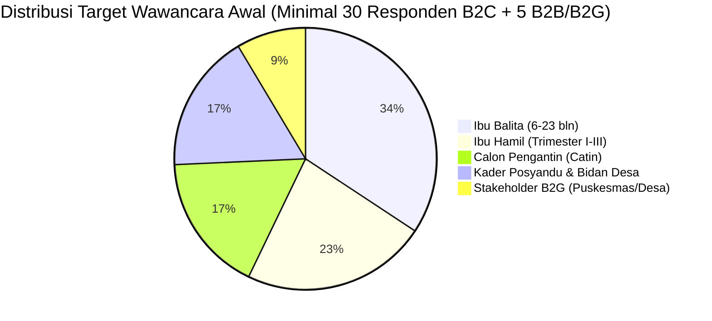

# 🎙️ Direktori Wawancara Customer Discovery — Geny StuntCare
*Pilar Validasi Lapangan, Eksplorasi Masalah Bebas Bias, & Pengujian Solusi 3 Pilar*  
*Inkubasi Startup Batch 24 Bandung Techno Park (BTP) : Telkom University*

---

## 📌 Ringkasan Eksekutif & Gambaran Umum

Direktori ini menghimpun seluruh instrumen, metodologi, skrip wawancara, panduan interpretasi jawaban, protokol etika, dan lembar kerja validasi lapangan untuk startup **Geny StuntCare**. Rangkaian instrumen ini dirancang sebagai jembatan empiris antara **notulensi materi workshop inkubasi BTP Stage 1** dengan **temuan intelijen riset saintifik (Laporan Final Determinan Stunting 2026)**.

Metodologi customer discovery ini menyatukan 4 pilar pengetahuan utama:
1. **Masterclass Sesi 1 (Indra Purnama, S.T., M.T.)**: Penerapan *6 Pertanyaan Emas Wawancara Eksploratif*, prinsip *Jobs to be Done (JTBD)*, larangan keras mempresentasikan solusi/jualan di awal (*anti-pitching*), serta aturan mendengarkan 80/20.
2. **Masterclass Sesi 3 (Muhammad Nur Awaludin / Kak Mumu)**: Validasi masalah sebelum membangun teknologi (*Vitamin vs Painkiller*), probing kualitatif mendalam (*5-Whys Laddering*), survei form hanya sebagai *second opinion*, serta pengujian prototipe pada 30–50 *end consumers* dan 3–5 *decision makers*.
3. **Sintesis Laporan Final Determinan Stunting (27 Halaman, 26 Sep 2026)**: Triangulasi 3 pilar bukti, penghindaran kata "stunting" di awal sesi demi mencegah bias stigma sosial, serta matriks sampling purposif 5 Sel (Sel A–E) mencakup kasus positif menyimpang (*positive deviance*).
4. **Validasi Model Prediktif Paper GENY (IBITeC 2026) & Buku TA**: Pengujian kebutuhan riil alat bantu triase antropometri kader posyandu yang beroperasi secara *offline-first*.

```
                         ARSITEKTUR VALIDASI CUSTOMER DISCOVERY
 ┌───────────────────────────────────────────────────────────────────────────────────────┐
 │ 1. TAHAP 1: PROBLEM DISCOVERY MURNI (Eksplorasi Masalah Bebas Bias)                   │
 │    ├─ Grand Tour Question: Membuka cerita pengalaman masa lalu seluas mungkin        │
 │    ├─ Laddering Probing (5-Whys): Menyelami akar penyebab masalah terdalam           │
 │    ├─ Peta Domain Sweep: Finansial, Waktu/Beban, Keluarga, Faskes, Stigma Sosial    │
 │    └─ Aturan Emas: Dilarang sebut "stunting" & dilarang menawarkan aplikasi          │
 └──────────────────────────────────────────┬────────────────────────────────────────────┘
                                            │
                                            ▼
 ┌───────────────────────────────────────────────────────────────────────────────────────┐
 │ 2. TAHAP 2: SOLUTION VALIDATION & WTP (Pengujian 3 Pilar Solusi Geny StuntCare)        │
 │    ├─ Pilar 1: Skrining Mandiri & Kalkulator Triase Antropometri Cepat (Offline-First)│
 │    ├─ Pilar 2: Asisten AI Konsultasi 24/7 (Pendampingan Gizi & Edukasi Warga)         │
 │    ├─ Pilar 3: Meal Planner MPASI Lokal Murah & Generator Komposisi Menu PMT Posyandu│
 │    └─ Validasi Model Bisnis: Willingness to Pay (WTP), Daya Beli B2C vs Model B2G     │
 └──────────────────────────────────────────┬────────────────────────────────────────────┘
                                            │
                                            ▼
 ┌───────────────────────────────────────────────────────────────────────────────────────┐
 │ 3. OUTPUT WAJIB DELIVERABLES SRL-0 (Startup Readiness Level 0 Bandung Techno Park)    │
 │    ├─ Verified Customer Persona Canvas (Ibu Hamil, Ibu Balita, Catin, Kader Posyandu)│
 │    ├─ Validated Customer Journey Map (Masa Kehamilan s/d Balita 59 Bulan)            │
 │    ├─ Pain & Gain Index + Problem Statement Teruji                                   │
 │    ├─ Analisis Kelemahan Kompetitor Eksisting (Buku KIA, e-PPGBM, Primaku)           │
 │    └─ Kalkulasi Ukuran Pasar Empiris (TAM, SAM, SOM Berbasis Bukti Lapangan)         │
 └───────────────────────────────────────────────────────────────────────────────────────┘
```

---

## 🗂️ Struktur Berkas & Panduan Akses Direktori

Folder `wawancara/` terdiri atas 5 berkas utama yang saling melengkapi secara modular:

| No | Nama Berkas | Deskripsi & Fungsi Operasional | Tautan Langsung |
| :---: | :--- | :--- | :--- |
| **1** | [`pertanyaan_wawancara.md`](file:///Users/sinitygs/Projects21/wawancara/pertanyaan_wawancara.md) | **Instrumen Inti 76 Pertanyaan Emas Lapangan**: Panduan wawancara mendalam terstruktur mencakup 4 persona utama (Ibu Hamil, Ibu Balita, Catin, Kader/Nakes) yang terbagi dalam Tahap 1 (Problem Discovery) dan Tahap 2 (Solution Validation). | [Buka Pertanyaan](file:///Users/sinitygs/Projects21/wawancara/pertanyaan_wawancara.md) |
| **2** | [`goals_wawancara.md`](file:///Users/sinitygs/Projects21/wawancara/goals_wawancara.md) | **Kerangka Interpretasi Jawaban & Pemetaan SRL-0**: Matriks dekonstruksi kode pertanyaan (U1–N11, T1–T3) ke arah hipotesis produk, SOP teknik laddering bebas bias, triangulasi literatur, dan pemetaan output ke SRL-0 BTP. | [Buka Goals & Interpretasi](file:///Users/sinitygs/Projects21/wawancara/goals_wawancara.md) |
| **3** | [`template_lembar_rekap_narasumber.md`](file:///Users/sinitygs/Projects21/wawancara/template_lembar_rekap_narasumber.md) | **Template Lembar Rekap Hasil Informan**: Formulir terstandarisasi untuk pencatatan transkrip 24 jam pasca-wawancara, ekstraksi kutipan verbatim emosional, catatan *positive deviance*, dan tabel checkpoint saturasi data. | [Buka Template Rekap](file:///Users/sinitygs/Projects21/wawancara/template_lembar_rekap_narasumber.md) |
| **4** | [`informed_consent_dan_protokol_etika.md`](file:///Users/sinitygs/Projects21/wawancara/informed_consent_dan_protokol_etika.md) | **Protokol Etika Riset & Persetujuan Informan**: Naskah informed consent lisan/tertulis, tata cara anonimisasi kode responden, kepatuhan UU Pelindungan Data Pribadi (UU PDP), serta prosedur mitigasi situasi emosional di lapangan. | [Buka Protokol Etika](file:///Users/sinitygs/Projects21/wawancara/informed_consent_dan_protokol_etika.md) |
| **5** | [`matriks_sampling_dan_wilayah_riset.md`](file:///Users/sinitygs/Projects21/wawancara/matriks_sampling_dan_wilayah_riset.md) | **Desain Sampling Purposif & 8 Titik Wilayah**: Distribusi kuota responden 5 Sel (Sel A–E), target responden di 8 wilayah Jawa Timur (Malang, Banyuwangi, Sidoarjo, Surabaya, Jember, Magetan), dan matriks saturasi tematik. | [Buka Matriks Sampling](file:///Users/sinitygs/Projects21/wawancara/matriks_sampling_dan_wilayah_riset.md) |

---

## 👥 4 Profil Segmen Persona yang Divalidasi

Sesuai rancangan aksi SLR 1 dan materi workshop Sesi 1 & 3, proses customer discovery menargetkan 4 segmen persona kunci:



1. **Ibu Balita (Fokus Usia 6–23 Bulan)**: Segmen pengguna utama (*core end-user*). Memvalidasi kebiasaan pemantauan kurva tumbuh kembang, titik jenuh menghadapi anak GTM, beban ekonomi susu formula vs pangan lokal, serta pengalaman stigma sosial di Posyandu.
2. **Ibu Hamil (Trimester I, II, III)**: Segmen pencegahan hulu 1000 HPK. Memvalidasi kepatuhan ANC, pemahaman hasil pemeriksaan LILA/tensi darah, kesiapan nutrisi pencegah BBLR, dan ketergantungan pada saran keluarga/mertua.
3. **Calon Pengantin (Catin)**: Segmen intervensi pranikah. Memvalidasi efektivitas bimbingan KUA/Puskesmas, kepatuhan skrining anemia, persepsi tanggung jawab calon ayah, serta format edukasi digital yang menarik bagi generasi muda.
4. **Tenaga Kesehatan & Kader Posyandu (ILP)**: Segmen operasional lapangan (*field champions*). Memvalidasi beban administrasi pelaporan berlapis (e-PPGBM / ASIK), akurasi antropometri kit, kendala koneksi *blank spot*, serta resistensi komunikasi saat menyampaikan status gizi warga.

---

## 🎯 Hubungan Integratif dengan Deliverables SRL-0 BTP

Data mentah dari instrumen wawancara ini secara langsung menjadi bahan baku utama pengisian dokumen kelulusan **Startup Readiness Level 0 (SRL-0)** Bandung Techno Park:

* **Customer Persona Canvas**: Divalidasi melalui profil nyata responden, beban waktu harian, kebiasaan aplikasi smartphone, serta ketakutan terbesar (*deepest pain*).
* **Customer Journey Map**: Divalidasi melalui kronologi perjalanan narasumber sejak masa kehamilan hingga balita balita berusia 2 tahun, memetakan momen kritis di mana ibu merasa putus asa atau berhenti datang ke Posyandu.
* **Value Proposition Canvas (VPC)**: Menyandingkan *Customer Jobs, Pains, & Gains* hasil wawancara dengan fitur *Products & Services, Pain Relievers, & Gain Creators* Geny StuntCare.
* **Validasi Model Bisnis (WTP & B2G Strategy)**: Membuktikan secara empiris bahwa model monetisasi B2C langganan kaku tidak cocok untuk keluarga rentan stunting ("tahu tapi tidak mampu"), sehingga mengarahkan model bisnis ke kemitraan institusional B2G (APBDes, BOK Puskesmas, CSR, dan program Makan Bergizi Gratis SPPG MBG 3B).

---

*© 2026 Tim Pengembang Geny StuntCare — Program Inkubasi Bisnis Startup BTP Batch 24 Telkom University.*
