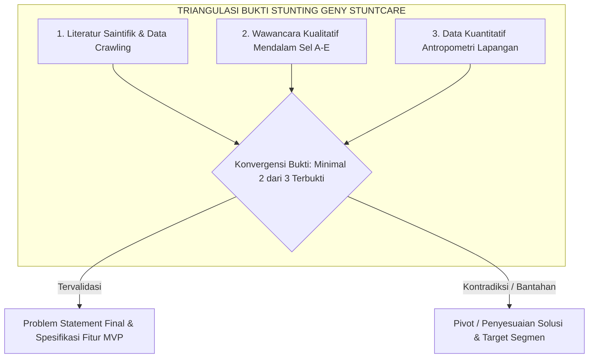
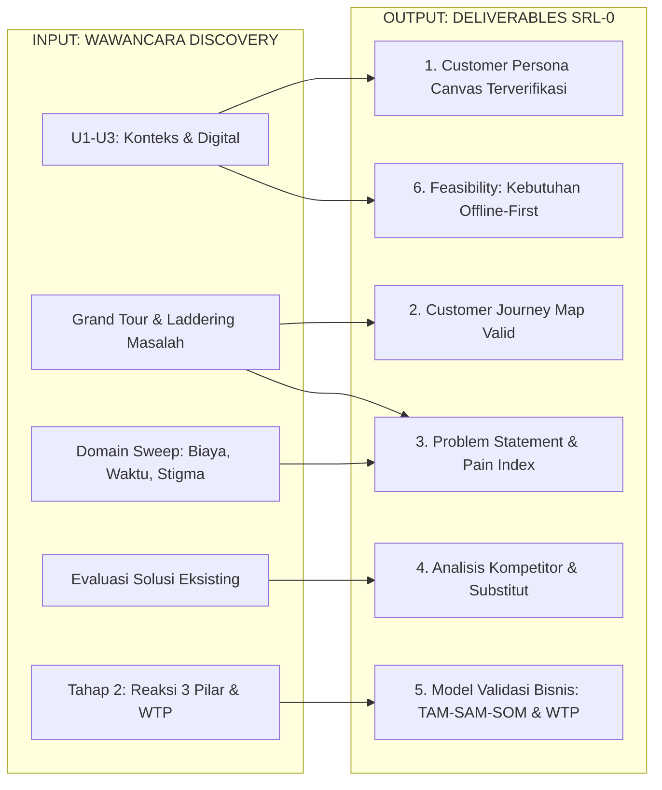

# 🎯 Goals & Panduan Evaluasi Wawancara Customer Discovery — Geny StuntCare
*Kerangka Interpretasi Jawaban, Dekonstruksi Akar Masalah, & Pemetaan Output SRL-0*  
*Program Inkubasi Startup Batch 24 Bandung Techno Park (BTP) : Telkom University*

---

> ### 📌 PANDUAN PENGGUNAAN DOKUMEN INI
> * **Kolom "Berarti" adalah Hipotesis Tim untuk Dianalisis, BUKAN Kesimpulan Mutlak.** Jangan pernah menggunakan asumsi di dokumen ini untuk menggiring, menyela, atau mendikte narasumber saat wawancara berlangsung.
> * **Triangulasi Saintifik:** Hasil analisis interpretasi dari instrumen ini akan disandingkan dengan **Dataset Nasional SKI 2023 / SSGI 2024**, **Laporan Final Determinan Stunting 2026 (27 Halaman)**, dan **Model Prediktif Paper GENY (CART Decision Tree, akurasi 75,57%)**.
> * **Waktu Evaluasi:** Wajib diisi dan dievaluasi maksimal **24 jam** setelah wawancara selesai dilaksanakan agar detail kontekstual dan ekspresi non-verbal informan tidak hilang dari memori tim.

---

## 🧭 1. Kerangka Evaluasi & Logika Interpretasi Jawaban

Tabel interpretasi berikut memetakan sinyal jawaban narasumber (apa yang mereka katakan dan rasakan) ke dalam hipotesis strategis arah pengembangan platform **Geny StuntCare**:

### A. Konteks Universal (Semua Persona: Q1–Q3)

| Kode | Aspek yang Dicari | Jika Narasumber Menjawab... | Berarti (Implikasi Produk & Bisnis) |
| :---: | :--- | :--- | :--- |
| **U1** | Struktur rumah tangga & pengambil keputusan | Ada mertua, nenek, atau orang tua yang dominan mengatur makanan dan pola asuh. | **Pengambil keputusan bukan ibu tunggal.** Target edukasi dan kampanye produk harus mencakup lingkungan keluarga besar (mertua/suami), bukan hanya ibu. |
| **U1** | Struktur rumah tangga & pengambil keputusan | Keluarga inti mandiri (hanya suami, istri, anak). | Otonomi ibu tinggi. Solusi personalisasi digital dapat langsung diadopsi tanpa hambatan tradisi generasi sebelumnya. |
| **U2** | Beban waktu & kesibukan harian | Bekerja penuh (buruh pabrik/kantoran) atau pedagang/tani yang sangat sibuk dari pagi sampai malam. | **Intervensi harus *low-touch* dan instan.** Fitur yang membutuhkan input manual panjang atau membaca teks panjang pasti diabaikan. Notifikasi WhatsApp singkat lebih disukai. |
| **U2** | Beban waktu & kesibukan harian | Ibu rumah tangga dengan beban domestik mengurus banyak anak balita. | Mengalami kelelahan kognitif (*decision fatigue*). Membutuhkan asisten otomatis yang langsung memberikan panduan menu cepat tanpa perlu berpikir keras. |
| **U3** | Kesiapan digital & perangkat HP | HP spesifikasi rendah (*entry-level*), memori penuh, sering hapus aplikasi, kuota internet hemat. | **Aplikasi berbasis web (*PWA / Responsive Web*) atau WhatsApp Bot lebih realistis** dibandingkan aplikasi native Android berukuran besar (>50 MB). |
| **U3** | Kesiapan digital & perangkat HP | HP memadai, aktif bermedia sosial (TikTok, Instagram, Shopee), terbiasa belanja online. | Kesiapan adopsi aplikasi mandiri tinggi. Konten edukasi berbasis video vertikal pendek (*micro-learning*) memiliki peluang viral dan retensi tinggi. |

---

### B. Persona Ibu Hamil (Q4–Q23)

| Kode | Aspek yang Dicari | Jika Narasumber Menjawab... | Berarti (Implikasi Produk & Bisnis) |
| :---: | :--- | :--- | :--- |
| **H1** | Titik masuk layanan kehamilan | Pertama kali curhat ke ibu kandung/mertua atau mencari di Google/TikTok, bukan ke bidan. | Lingkaran keluarga dan media sosial adalah *gatekeeper* informasi awal. Distribusi konten Geny StuntCare harus masuk ke kanal-kanal organik tersebut. |
| **H2** | Kepatuhan ANC & alasan bolos kontrol | Bolos kontrol karena alasan jarak faskes jauh, antrean sangat lama, atau tidak ada biaya transportasi. | Hambatan utama adalah **Akses Fisik & Biaya Logistik**, bukan kurangnya kesadaran. Solusi pemantauan mandiri di rumah sangat bernilai (*high painkiller*). |
| **H2** | Kepatuhan ANC & alasan bolos kontrol | Bolos kontrol karena "merasa badan sehat-sehat saja" atau menganggap periksa tiap bulan tidak perlu. | Hambatan utama adalah **Persepsi Risiko yang Rendah**. Solusi membutuhkan fitur *visualisasi risiko masa depan* (menjelaskan bahaya janin gagal tumbuh meski ibu merasa sehat). |
| **H3** | Pemahaman hasil pemeriksaan | Diperiksa tensi/LILA/lab tapi tidak paham arti angkanya, atau bidan/dokter terlalu sibuk menjelaskan. | **Ada celah komunikasi faskes.** Fitur kalkulator LILA & BB mandiri yang menerjemahkan angka medis menjadi bahasa awam yang menenangkan akan sangat dicari ibu hamil. |
| **H4–H5** | Masalah spontan (Grand Tour & Laddering) | Menyebutkan masalah fisik (mual muntah, lemas) atau kecemasan persalinan dan keuangan. | Bahan utama *Problem Statement*. Urutan tema yang disebut secara spontan mencerminkan prioritas penderitaan riil ibu hamil. |
| **H6** | Domain finansial & waktu | Pengeluaran untuk suplemen kehamilan dan makanan bergizi tertekan kebutuhan harian lain. | Konfirmasi fenomena *"tahu tapi tidak mampu"*. Fitur rekomendasi gizi wajib memprioritaskan sumber pangan lokal paling murah berdensitas protein tinggi (telur, lele, tempe). |
| **H7** | Akar masalah (*Root Cause*) | Menyimpulkan masalah terbesarnya adalah minimnya dukungan suami atau ketiadaan panduan praktis harian. | Arah solusi harus mengintegrasikan modul pendampingan suami (*father-friendly interface*) dan checklist harian yang mudah dieksekusi. |
| **H8** | Pengalaman aplikasi lain | Pernah pasang aplikasi kehamilan tetapi dihapus karena terlalu rumit, banyak iklan, atau tidak relevan dengan kultur Indonesia. | Celah diferensiasi produk: Geny StuntCare harus menghadirkan antarmuka minimalis, bebas distraksi iklan, dan berbasis kontekstual pangan lokal Indonesia. |
| **H9** | Pengalaman berbayar & jangkar harga | Pernah membayar konsultasi dokter online/bidan swasta Rp25.000–Rp50.000 sekali sesi. | Terdapat preseden kesediaan membayar (*willingness to pay*), namun frekuensi penggunaannya insidental, bukan model langganan bulanan kaku. |
| **H10** | Prioritas perbaikan tertinggi | Ingin kepastian bahwa janin di kandungan tumbuh normal dan terhindar dari cacat lahir/stunting. | Nilai proposisi utama (*core value proposition*) ibu hamil adalah **Rasa Tenang (*Peace of Mind*) & Kepastian Pertumbuhan Janin**. |

---

### C. Persona Ibu dengan Balita (Q24–Q42)

| Kode | Aspek yang Dicari | Jika Narasumber Menjawab... | Berarti (Implikasi Produk & Bisnis) |
| :---: | :--- | :--- | :--- |
| **B1** | Cara pemantauan tumbuh kembang | Hanya tahu status anak sebulan sekali saat Posyandu, atau sekadar mengira-ngira dari ukuran baju/celana. | **Ada *monitoring black hole* (kekosongan pemantauan) selama 30 hari antar-jadwal posyandu.** Peluang emas fitur kurva mandiri di rumah. |
| **B2** | Kontinuitas posyandu & pemahaman buku KIA | Datang posyandu tapi buku KIA jarang dibaca/tidak paham cara membaca grafik kurva Z-score WHO. | Grafik kurva WHO di buku KIA terlalu rumit bagi orang awam. Geny StuntCare harus menerjemahkan Z-score ke dalam indikator warna visual (*traffic light system*: hijau-kuning-merah). |
| **B3** | Respon saat anak sakit / GTM | Saat anak susah makan, pertama kali tanya grup WA ibu-ibu atau akun medsos, bukan ke nakes. | Perilaku pencarian solusi berbasis peer-to-peer. Asisten AI harus memiliki gaya bahasa ramah seperti sesama ibu (*friendly peer tone*), bukan bahasa dokter yang kaku. |
| **B4–B5** | Masalah spontan (Grand Tour & Laddering) | Menegaskan stres menghadapi anak GTM (*Gerakan Tutup Mulut*), anak gampang sakit/diare, atau berat badan seret (*weight faltering*). | Masalah paling menyakitkan (*severest pain*) ibu balita adalah **Anak Susah Makan & Berat Badan Stagnan**, bukan konsep abstrak "stunting". Solusi harus diposisikan sebagai "Solusi Atasi Anak Susah Makan". |
| **B6** | Pengeluaran untuk anak | Membeli susu formula kental manis atau jajanan ultra-proses karena anak menangis menolak nasi. | Terjadi misalokasi anggaran gizi. Modul MPASI harus mengajarkan teknik variasi rasa dan tekstur agar anak tidak menolak makanan bergizi rumahan. |
| **B7** | Stigma sosial & rasa malu | Mengaku malas/malu datang ke Posyandu karena anaknya sering dikomentari kurus/pendek oleh tetangga atau kader. | **Stigma sosial adalah penyebab utama *drop-out* Posyandu.** Pesan antarmuka dan notifikasi aplikasi HARUS membangkitkan empati, bebas label negatif, dan bersifat privat (*safe space*). |
| **B8** | Akar masalah pengasuhan | Menyimpulkan kebingungan menyusun menu makanan harian yang bervariasi tapi tetap murah. | Validasi kebutuhan *Pilar 3: Meal Planner MPASI Lokal Ekonomis*. |
| **B9–B10**| Penilaian terhadap sistem pencatatan | Menganggap e-PPGBM atau KMS hanya untuk urusan administrasi kader/kelurahan, tidak memberi manfaat balik bagi ibu. | **Sistem pemerintah melayani birokrasi, bukan melayani ibu.** Geny StuntCare mengisi kekosongan sebagai platform yang berpusat pada kebutuhan ibu (*user-centered design*). |
| **B11** | Prioritas bantuan tertinggi | Butuh panduan takaran porsi makan anak yang praktis dan kepastian apakah anaknya tumbuh sesuai standar. | Proposisi nilai: Panduan porsi makan harian berbasis foto/visual sederhana dan pengingat jadwal timbang rutin. |

---

### D. Persona Calon Pengantin (Catin: Q43–Q59)

| Kode | Aspek yang Dicari | Jika Narasumber Menjawab... | Berarti (Implikasi Produk & Bisnis) |
| :---: | :--- | :--- | :--- |
| **C1** | Peta kesiapan pernikahan | Waktu dan pikiran tersedot 95% untuk acara resepsi, sewa gaun, dan undangan; urusan kesehatan dikesampingkan. | Isu kesehatan pranikah bersaing ketat dengan prioritas acara seremonial. Edukasi harus dikemas sangat ringkas, menarik, dan tidak menambah beban stres. |
| **C2** | Paparan bimbingan pranikah | Mengikuti bimbingan formal di KUA/Puskesmas tapi merasa ceramahnya membosankan dan cepat lupa. | Metode edukasi ceramah konvensional tidak efektif. Catin membutuhkan format interaktif kuis kesiapan pranikah digital yang menyenangkan. |
| **C3** | Pemeriksaan kesehatan pranikah | Melakukan cek darah/LILA di Puskesmas tetapi hanya demi lembar surat keterangan syarat nikah, tidak tahu arti kadar Hb. | Pemeriksaan hanya diposisikan sebagai formalitas syarat administratif birokrasi. Solusi harus mengedukasi korelasi langsung antara anemia ibu hamil dengan risiko bayi lahir BBLR/stunting. |
| **C4–C5**| Beban pikiran menuju pernikahan | Sama sekali tidak menyebut kekhawatiran soal gizi atau anak; fokus ke masalah finansial dan kecocokan keluarga. | **Urgensi isu stunting pada catin sangat rendah secara spontan.** Catin bukan persona pembeli (*buyer*) utama B2C, melainkan target intervensi kebijakan publik (*B2G channel*). |
| **C8** | Keterlibatan calon suami | Menganggap urusan gizi dan anak kelak adalah urusan calon istri, pihak laki-laki hanya bertugas mencari nafkah. | Sasaran literasi harus menyentuh calon ayah. Perlu modul khusus "Peran Suami Siaga Gizi 1000 HPK" dengan bahasa yang relevan bagi laki-laki muda. |
| **C9** | Kanal informasi terpercaya | Mengikuti akun media sosial dokter kandungan/edukator muda (Instagram/TikTok) atau bertanya ke teman sebaya. | Strategi distribusi edukasi pranikah paling tepat lewat *influencer marketing* dan konten media sosial kreatif, bukan lewat situs web formal kaku. |
| **C10** | Ketakutan jangka panjang | Khawatir jika anak kelak sering sakit-sakitan atau memiliki keterlambatan perkembangan otak di sekolah. | Narasi pencegahan stunting pada catin harus difokuskan pada **Kecerdasan Otak & Prestasi Masa Depan Anak**, bukan sekadar tinggi badan fisik semata. |

---

### E. Persona Tenaga Kesehatan, Kader Posyandu, & TPK (Q60–Q76)

| Kode | Aspek yang Dicari | Jika Narasumber Menjawab... | Berarti (Implikasi Produk & Bisnis) |
| :---: | :--- | :--- | :--- |
| **N1** | Alur operasional Posyandu | Banyak tahapan manual berulang (mencatat di kertas, mengukur manual, menghitung buku bantu, merekap register). | **Titik efisiensi terbesar produk.** Aplikasi yang mengotomatisasi perhitungan kurva dan rekapitulasi data akan langsung menghemat 2–3 jam kerja kader per hari posyandu. |
| **N2** | Alur pencatatan & pelaporan | Mengeluh harus menginput data berulang kali ke buku register posyandu, buku bantu, dan sistem e-PPGBM/ASIK yang sering down. | Beban administrasi berlebihan (*administrative burnout*). Kader membutuhkan fitur ekspor laporan satu-kali-klik (*one-click reporting export*) ke format standar Kemenkes. |
| **N3** | Standarisasi alat ukur | Masih menggunakan timbangan dacin kain gantung, meteran pita kain, atau alat antropometri yang tidak terkalibrasi. | **Integritas data dari sumbernya sudah bermasalah.** Algoritma Geny StuntCare harus memiliki fitur *Data Anomaly Validation* (mendeteksi data pengukuran tidak wajar/ekstrim). |
| **N4–N6**| Beban kerja & insentif kader | Beban 25 kompetensi Posyandu ILP terlalu berat, sementara insentif kader hanya Rp50.000–Rp100.000 per bulan. | Hambatan struktural sistemik. Kader tidak mungkin dibebani biaya aplikasi. **Aplikasi untuk kader wajib 100% gratis bagi pengguna akhir**, dibiayai anggaran Desa/B2G. |
| **N7** | Hambatan komunikasi warga | Sering dimarahi atau dijauhi warga ketika melaporkan balita berstatus stunting; warga menolak dikunjungi ke rumah. | Kader membutuhkan modul *Komunikasi Antar-Pribadi (KAP) Efektif* di dalam aplikasi, berisi panduan skrip kalimat santun saat menyampaikan hasil evaluasi gizi. |
| **N8** | Kendala konektivitas sinyal | Sinyal internet sering tidak stabil atau mati total di lokasi posyandu/pelosok desa. | **Arsitektur Offline-First adalah Syarat Mutlak Mati.** Aplikasi harus bisa menginput data, menghitung Z-score, dan menyimpan ratusan data secara lokal tanpa internet. |
| **N9** | Akar masalah operasional | Menganggap sistem pelaporan digital dari pusat terlalu lambat, rumit dipelajari, dan tidak ramah bagi kader berusia lanjut. | Antarmuka Geny StuntCare harus dirancang dengan pendekatan *Extreme Simplicity* (huruf besar, kontras tinggi, alur maksimal 3 langkah, tanpa istilah teknis rumit). |
| **N10** | Pemanfaatan data posyandu | Data yang diinput ke e-PPGBM tidak pernah turun kembali menjadi grafik tren yang bisa dilihat kader dan lurah secara mudah. | Geny StuntCare harus menyediakan dasbor visual analitik tingkat desa yang memperlihatkan peta sebaran risiko gizi secara real-time. |
| **N11** | Prioritas perombakan sistem | Menginginkan sistem pencatatan digital yang cepat, alat ukur digital otomatis, dan pelaporan yang tidak berbelit-belit. | Menjadi dasar positioning produk Geny StuntCare sebagai **Posyandu Digital Smart Hub**. |

---

### F. Tahap 2: Validasi Solusi 3 Pilar & Willingness to Pay (Q19–Q22, Q38–Q41, Q56–Q58, Q72–Q75)

| Kode | Aspek yang Dicari | Jika Narasumber Menjawab... | Berarti (Implikasi Model Bisnis & Produk) |
| :---: | :--- | :--- | :--- |
| **T1** | Preferensi 3 Pilar Layanan | Mayoritas ibu memilih **Pilar 1 (Monitoring Mandiri Cepat)** atau **Pilar 3 (Menu Lokal Murah)**; chatbot hanya pelengkap. | **Fokus fitur utama produk adalah Skrining Cepat & Perencanaan Menu.** Fitur chatbot AI diposisikan sebagai asisten pendukung, bukan fitur jualan utama. |
| **T2** | Tingkat kepercayaan AI vs Manusia | Narasumber tidak percaya 100% pada hasil diagnosis aplikasi otomatis; tetap menuntut konfirmasi bidan/dokter. | **Aplikasi tidak boleh menggantikan nakes.** Positioning aplikasi adalah *Alat Skrining Awal & Triase Risiko*, yang selalu mengarahkan ke faskes jika ditemukan anomali (*human-in-the-loop*). |
| **T3** | Willingness to Pay (WTP) B2C | Ibu menolak membayar biaya langganan bulanan Rp15.000–Rp25.000 karena lebih memilih mengalokasikan uang untuk membeli makanan/telur. | **Model monetisasi B2C murni (*freemium/subscription*) sangat rentan gagal di segmen akar rumput.** Mengonfirmasi bukti literatur "tahu tapi tidak mampu". |
| **T3** | Model Monetisasi B2B / B2G | Kader dan instansi menyatakan dana desa, puskesmas (BOK), CSR BUMN/Swasta, atau SPPG MBG dapat mengalokasikan anggaran sistem. | **Arah model bisnis Geny StuntCare yang paling berkelanjutan adalah B2G / B2B2G:** Lisensi platform dibiayai oleh APBDes / Dinas Kesehatan / CSR, diberikan gratis kepada kader dan ibu balita. |

---

## 🛠️ 2. Standar Operasional Prosedur (SOP) Teknik Wawancara Bebas Bias

Untuk menghasilkan temuan yang valid dan diakui dalam sidang evaluasi BTP, tim wajib menerapkan 7 teknik berikut:

1. **Grand Tour Dulu, Baru Menyempit**: Selalu awali bagian masalah dengan pertanyaan paling luas (*"Apa hal yang paling berat/melelahkan..."*). Jangan pernah menyebut kata kunci "gizi", "biaya", atau "stunting" di awal babak masalah. Biarkan topik tersebut meluncur secara alami dari mulut responden.
2. **Laddering Probing (5-Whys Exploration)**: Saat responden menyebut suatu hambatan (misal: "Saya capek ngurus anak"), jangan berhenti di sana. Lakukan penggalian berjenjang:
   * *"Mengapa hal itu terasa paling melelahkan bagi Ibu?"*
   * *"Bisa diceritakan kejadian terakhir kali hal itu terjadi?"*
   * *"Waktu itu Ibu mencoba melakukan apa?"*
   * *"Siapa lagi yang terdampak di rumah tangga?"*
3. **Peta Domain Sweep**: Gunakan 6 domain (Finansial, Beban Waktu, Dinamika Keluarga, Akses Layanan, Informasi, Stigma Emosional) sebagai radar pendengar. Tanyakan domain tertentu HANYA jika domain tersebut sama sekali belum tersentuh dalam cerita spontan narasumber.
4. **Fallback Question HANYA untuk Topik yang Belum Muncul**: Pertanyaan pola makan/gizi adalah pertanyaan cadangan (*fallback*). Ini mencegah bias tim di mana gizi disimpulkan sebagai masalah utama hanya karena pewawancara yang terus-menerus menanyakannya.
5. **Positive Deviance (Kasus Negatif itu Emas)**:
   * *Kasus Negatif Tipe 1*: Keluarga ekonomi desil terbawah, sanitasi buruk, tetapi anak balitanya tumbuh optimal dan cerdas. Gali pola asuh dan ketahanan pangan spesifik mereka!
   * *Kasus Negatif Tipe 2*: Keluarga ekonomi mampu, akses posyandu dekat, tetapi anak balitanya terdiagnosis stunting. Bongkar dinamika pengasuhan, riwayat BBLR, atau kendala penyerapan gizi!
6. **Rekam Kutipan Verbatim Penuh Emosi**: Catat kata demi kata (*verbatim*) saat responden mengekspresikan emosi jujur (menangis, malu, marah, tertawa lega). Kalimat verbatim adalah senjata paling kuat dalam menyusun *pitch deck* dan validasi persona.
7. **Pengamatan Bahasa Tubuh & Lingkungan (Non-Verbal Observation)**: Perhatikan apakah responden melirik ke arah mertua saat menjawab, apakah tampak ragu saat menyebut angka penghasilan, dan bagaimana kondisi kebersihan dapur serta ketersediaan air bersih di lokasi rumah.

---

## 🔬 3. Matriks Triangulasi: Temuan Lapangan vs Hipotesis Literatur

Setelah transkrip selesai direkap, sandingkan pola temuan lapangan dengan tabel triangulasi bukti saintifik stunting berikut:

| Hipotesis Literatur Riset (Data Crawling 2026) | Indikator Konfirmasi Lapangan | Indikator Bantahan Lapangan |
| :--- | :--- | :--- |
| **Stigma Sosial Penyebab Drop-Out Posyandu** | Responden secara spontan mengaku malu/tersinggung saat anaknya dikomentari pendek/kurus oleh kader, lalu memilih absen posyandu. | Responden tidak keberatan dengan komentar kader, dan alasan absen murni karena bentrok jadwal kerja pabrik. |
| **Administrative Burnout pada Kader Posyandu** | Kader mengeluh waktu pelayanan tersita untuk mencatat data di 3–4 format berbeda; sistem online lambat dan sering down. | Kader merasa pencatatan digital saat ini sudah sangat mudah, cepat, dan tidak ada kendala waktu sama sekali. |
| **Ketiadaan Internet Menghambat Layanan Digital** | Di wilayah rural/pinggiran, koneksi sering terputus total sehingga pencatatan aplikasi online mandek. | Seluruh lokasi survei memiliki sinyal 4G/5G stabil tanpa kendala koneksi kapan pun. |
| **Dominasi Mertua dalam Keputusan Pola Asuh** | Ibu mengaku terpaksa memberi makanan padat sebelum usia 6 bulan atau dilarang makan ikan karena perintah mertua. | Ibu memiliki wewenang 100% mutlak tanpa campur tangan keluarga besar dalam menentukan menu makanan anak. |
| **Fenomena "Tahu Tapi Tidak Mampu"** | Ibu tahu pentingnya telur dan daging, tetapi uang belanja habis untuk beras, pulsa, rokok bapak, atau cicilan. | Ibu tidak membeli protein hewani murni karena menganggap sayur dan nasi saja sudah cukup (masalah murni ketidaktahuan). |
| **WTP B2C Rendah pada Segmen Rentan** | Ibu menolak membayar aplikasi pemantau gizi dan memilih mengalokasikan dana untuk belanja dapur riil. | Ibu dengan antusias bersedia membayar biaya langganan bulanan di atas Rp25.000 per bulan secara mandiri. |

---

## 📑 4. Template Lembar Rekap Hasil per Narasumber

> *Salin dan gunakan template ini untuk setiap 1 sesi wawancara yang telah selesai dilakukan. Wajib diarsipkan dalam folder proyek.*

### Lembar Rekap Wawancara: Informan #[Kode_ID]

#### A. Identitas Informan (Anonim Terproteksi)
* **Kode Narasumber**: `[Misal: IB-01 / IH-02 / CT-01 / NK-01]`
* **Kategori Persona**: `[Ibu Hamil / Ibu Balita / Calon Pengantin / Kader Posyandu]`
* **Usia Informan**: `... Tahun`
* **Wilayah Domisili**: `[Perkotaan / Pinggiran Kota / Pedesaan - Sebutkan Kota/Kabupaten]`
* **Estimasi Strata Ekonomi**: `[Kurang Mampu (Desil 1-3) / Menengah / Menengah-Keatas]`
* **Pekerjaan Utama**: `...`
* **Pendidikan Terakhir**: `[SD / SMP / SMA / Diploma / Sarjana]`
* **Tanggal & Durasi Sesi**: `... WIB (Durasi: ... Menit)`
* **Pewawancara & Pencatat**: `...`
* **Dokumentasi Audio**: `[Ada Rekaman / Catatan Tulis Sah]`
* **Informed Consent**: `[Persetujuan Lisan Diberikan / Formulir Tertulis Ditandatangani]`

#### B. Konteks Rumah Tangga & Kesiapan Digital (U1–U3)
* **Pengambil Keputusan Utama**: `...`
* **Beban Waktu Harian**: `...`
* **Spesifikasi HP & Pola Aplikasi**: `...`

#### C. Snapshot Customer Journey (3–5 Peristiwa Kunci)
1. `...`
2. `...`
3. `...`

#### D. Masalah yang Muncul Secara SPONTAN (Grand Tour & Laddering)

| Isu / Keluhan yang Disebutkan | Domain Masalah | Sejak Kapan Terjadi | Upaya Penanganan yang Dicoba | Kutipan Verbatim Penuh Emosi |
| :--- | :--- | :--- | :--- | :--- |
| *Contoh: Anak GTM tiap makan nasi* | *Pola Asuh / Emosi* | *Usia 8 bulan* | *Diberi susu kental manis botol* | *"Saya sampai nangis di dapur tiap kali piring makannya dilempar..."* |
| `...` | `...` | `...` | `...` | `...` |

#### E. Analisis Akar Masalah Menurut Informan (*Root Cause*)
* `[Tuliskan kesimpulan narasumber sendiri mengenai sumber masalah terbesarnya]`

#### F. Evaluasi Solusi / Aplikasi yang Pernah Digunakan
* **Nama Solusi / Aplikasi**: `...`
* **Status Penggunaan**: `[Masih Aktif / Jarang Dibuka / Sudah Dihapus]`
* **Alasan Ditinggalkan**: `...`

#### G. Tanggapan Validasi Solusi 3 Pilar & WTP (Khusus Tahap 2)
* **Pilar Fitur Paling Dibutuhkan**: `[Pilar 1 / Pilar 2 / Pilar 3]` — Alasan: `...`
* **Tingkat Kepercayaan Hasil AI**: `[Percaya Penuh / Butuh Verifikasi Nakes / Ragu-ragu]`
* **Kesediaan Membayar (WTP)**: `Rp... / Bulan (Atau: Menolak membayar sendiri)`
* **Pihak yang Wajar Membiayai**: `[Keluarga Sendiri / Pemerintah Desa / Puskesmas / Gratis]`

#### H. Kutipan Kunci Terbaik (*Emotional Goldmine*)
> *"..."*

#### I. Catatan Kasus Khusus (*Positive Deviance* / Kejutan Lapangan)
* `...`

#### J. Refleksi Pewawancara (Bias, Gangguan Situasional, Catatan Kritis)
* `...`

---

## 📊 5. Matriks Rekapitulasi Lintas Narasumber (Checkpoint Saturation)

Gunakan tabel matriks ini untuk memetakan frekuensi tema lintas 10–20 narasumber pertama guna mendeteksi titik kejenuhan data (*thematic saturation*):

| Kode ID | Persona | Masalah Utama #1 (Spontan) | Domain Dominan | Akar Masalah Versi Responden | Prioritas Tertinggi | Pilihan Pilar Tahap 2 | Nilai WTP (Rp) | Sumber Pembayar yang Wajar |
| :---: | :---: | :---: | :---: | :---: | :---: | :---: | :---: | :---: |
| **IB-01** | Ibu Balita | Anak GTM & BB stagnan | Pola Asuh/Gizi | Bingung variasi menu murah | Solusi anak mau makan | Pilar 3 (Menu Lokal) | Rp0 (Minta gratis) | Pemerintah / Puskesmas |
| **IB-02** | Ibu Balita | Malu anak dikatai pendek | Stigma/Sosial | Nyinyiran tetangga & kader | Pengukuran privat mandiri | Pilar 1 (Kurva Mandiri)| Rp10.000 / bln | Mandiri |
| **IB-03** | Ibu Balita | Uang belanja susu kurang | Finansial | Suami buruh harian | Bantuan PMT bergizi | Pilar 3 (Menu Lokal) | Rp0 | Bansos Desa |
| **IH-01** | Ibu Hamil | LILA kecil / KEK | Akses Faskes | Tidak paham arti hasil lab | Penjelasan hasil periksa | Pilar 1 (Skrining Mandiri)| Rp15.000 / bln | Mandiri |
| **IH-02** | Ibu Hamil | Mual muntah berat | Fisik/Kesehatan | Kurang dukungan suami | Asisten konsultasi 24 jam | Pilar 2 (Asisten AI) | Rp20.000 / bln | Suami |
| **CT-01** | Catin | Biaya resepsi nikah bengkak | Finansial | Tekanan gengsi keluarga | Kesiapan mental & dana | Pilar 1 (Skor Kesiapan)| Rp25.000 (sekali) | Bundling KUA |
| **CT-02** | Catin | Tidak paham gizi 1000 HPK | Informasi | Kurangnya edukasi pranikah | Edukasi ringkas di HP | Pilar 3 (Modul Gizi) | Rp0 | Gratis BKKBN |
| **NK-01** | Kader | Server e-PPGBM sering down | Infrastruktur | Beban input ganda sistem | Pencatatan cepat offline | Pilar 1 (Kalkulator Offline)| Rp0 (Dibiayai Desa) | Dana Desa |
| **NK-02** | Kader | Dimarahi warga saat vonis | Sosial/Masyarakat| Warga tidak terima stunting | Panduan komunikasi santun | Pilar 2 (Edukasi Warga) | Rp0 (Dibiayai Desa) | Puskesmas |
| **NK-03** | Nakes/Bidan| Balita drop-out posyandu | Sistem Layanan | Kurangnya sistem monitoring | Deteksi risiko balita mangkir | Pilar 1 (Monitoring Hub) | Anggaran BOK | Dinas Kesehatan |

---

## 🎯 6. Matriks Pemetaan Goal Wawancara → Deliverables SRL-0

Seluruh butir pertanyaan dan evaluasi dalam panduan ini terhubung langsung dengan output wajib **Startup Readiness Level 0 (SRL-0)** Bandung Techno Park:

| Output Deliverable SRL-0 BTP | Kode Pertanyaan Wawancara Sumber Data | Bukti Konkret yang Dihasilkan |
| :--- | :--- | :--- |
| **1. Customer Persona Canvas Terverifikasi** | Q1–Q3 [U1–U3], Q6 [H3], Q26 [B3], Q53 [C8], Q59 [C10] | Profil demografis, perilaku teknologi, struktur pengambil keputusan, serta ketakutan terdalam (*deepest fear*) tiap segmen. |
| **2. Customer Journey Map Valid** | Q4–Q7 [H1–H2], Q24–Q26 [B1–B2], Q43–Q45 [C1–C2], Q60–Q62 [N1–N3] | Alur langkah kronologis yang dilalui ibu dan kader, mengidentifikasi titik frustrasi (*pain points*) dan titik jeda layanan (*service drop-off*). |
| **3. Problem Statement & Pain Index** | Seluruh pertanyaan Grand Tour, Laddering Probing, Root Cause, dan Closing | Rumusan masalah berbasis format standar: *"Siapa [User] mengalami kesulitan [Pain] karena [Akar Masalah], yang berdampak pada [Konsekuensi Emosional/Finansial]"*. |
| **4. Analisis Kompetitor & Solusi Alternatif** | Q17–Q18 [H8–H9], Q36–Q37 [B9–B10], Q54–Q55 [C9], Q70–Q71 [N10] | Analisis kelemahan Buku KIA manual, aplikasi e-PPGBM pemerintah, serta aplikasi parenting komersial (Primaku/Tentang Anak). |
| **5. Model Validasi Bisnis (WTP & SAM/SOM)** | Q18 [H9], Q21–Q22 [H-T3], Q40–Q41 [B-T3], Q58 [C-T3], Q74–Q75 [N-T3] | Ambang batas kemampuan bayar pengguna akar rumput dan justifikasi peralihan ke model kemitraan kelembagaan B2G (Dana Desa / BOK). |
| **6. Kelayakan Teknis Produk (*Feasibility*)** | Q3 [U3], Q68 [N8], Q73 [N-T2] | Spesifikasi non-fungsional arsitektur perangkat lunak: wajib beroperasi tanpa internet (*offline-first*), sinkronisasi otomatis, dan ukuran ringan. |

---

*Disusun secara komprehensif untuk Tim Validasi Bisnis Geny StuntCare — Inkubasi Startup BTP Batch 24 Telkom University.*
