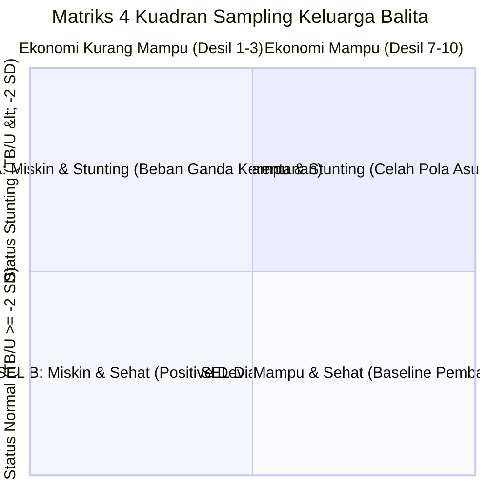
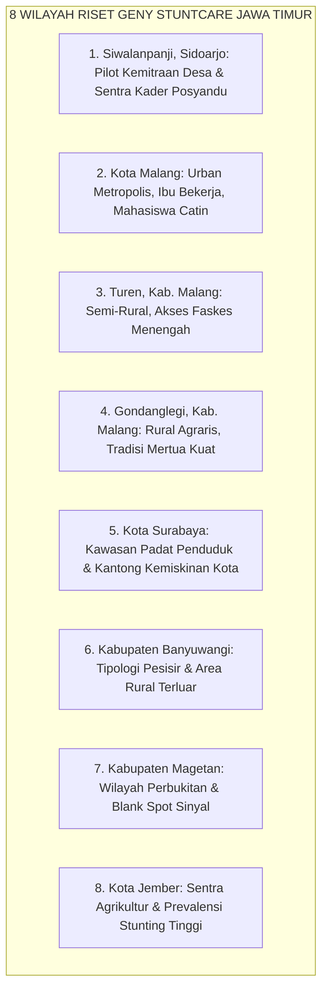

# 🗺️ Matriks Desain Sampling Purposif & Sebaran Wilayah Riset
*Strategi Pengambilan Sampel Multi-Sel (Sel A–E), Kuota Responden, & Pemetaan 8 Wilayah Lapangan*  
*Startup Geny StuntCare — Inkubasi Bisnis Startup BTP Batch 24 Telkom University*

---

## 📌 Landasan Metodologi Desain Sampling

Riset validasi masalah (*Customer Discovery*) Geny StuntCare tidak menggunakan metode acak sederhana (*simple random sampling*), melainkan **Sampling Purposif Berstrata (*Stratified Purposive Sampling*)** yang diturunkan langsung dari rekomendasi metodologis **Laporan Final Determinan Stunting Indonesia (26 September 2026)** dan **Notulensi Workshop BTP Sesi 1 & 3**:

1. **Menghindari Bias Sosio-Ekonomi Tunggal**: Stunting di Indonesia bukan hanya masalah kemiskinan ekstrem, melainkan juga terjadi pada 14–18% keluarga mampu akibat malnutrisi pengasuhan dan infeksi berulang. Oleh karena itu, sampel wajib mencakup spektrum ekonomi luas.
2. **Kekuatan Kasus Menyimpang Positif (*Positive Deviance*)**: Kunci inovasi nutrisi lokal ditemukan pada keluarga miskin yang anaknya tetap tumbuh sehat dan bebas stunting (Sel B).
3. **Standar Validasi Inkubasi BTP Batch 24**: Menguji pada target **30–50 *end consumers*** (ibu balita, ibu hamil, catin) dan **3–5 *decision makers / enterprise*** (Bidan Desa, Kepala Puskesmas, Kepala Desa / Pengelola Anggaran).

---

## 🔬 1. Matriks Sampling 5 Sel (Kualitatif Triangulasi)

Setiap informan yang diwawancarai diklasifikasikan ke dalam salah satu dari 5 sel riset berikut:



| Kode Sel | Definisi Kategori Responden | Target Kuota Responden | Karakteristik Utama yang Digali |
| :---: | :--- | :---: | :--- |
| **SEL A** | **Keluarga Kurang Mampu — Balita Terindikasi Stunting / Gagal Tumbuh** | **8 – 12 Informan** | Menyelami jebakan *"tahu tapi tidak mampu"*, kendala sanitasi/air bersih, pengeluaran terserap rokok/beras, beban biaya berobat, serta pengalaman stigma di posyandu. |
| **SEL B** | **Keluarga Kurang Mampu — Balita Tumbuh Sehat & Bebas Stunting (*Positive Deviance*)** | **8 – 12 Informan** | **KASUS EMAS**: Menemukan strategi kearifan lokal (*coping mechanism*), pemilihan protein hewani lokal murah (lele, telur, tempe), kebersihan dapur mandiri, dan dukungan keluarga yang kuat. |
| **SEL C** | **Keluarga Mampu — Balita Terindikasi Stunting / Gizi Kurang** | **6 – 10 Informan** | Menyelami anomali pengasuhan: riwayat kelahiran BBLR/prematur, anak kecanduan jajan ultra-proses (*snack* manis/gurih), minimnya ASI eksklusif, atau pengasuhan diserahkan penuh ke ART tanpa pengawasan gizi. |
| **SEL D** | **Keluarga Mampu — Balita Tumbuh Sehat & Sesuai Standar (*Baseline Control*)** | **6 – 10 Informan** | Menjadi tolok ukur (*benchmark*) perilaku melek gizi, kebiasaan rutin membaca buku KIA / aplikasi parenting modern, serta pola makan seimbang sejak MPASI dini. |
| **SEL E** | **Tenaga Kesehatan, Kader Posyandu, & Pemangku Kebijakan Desa/Puskesmas** | **6 – 8 Informan** | Menilai beban administrasi pelaporan data (e-PPGBM/ASIK), kendala akurasi alat ukur antropometri kit, kebutuhan *offline-first*, dan alur penganggaran dana desa/BOK. |

> **Total Target Sampel Kualitatif Lapangan:** **34 – 52 Responden Wawancara Mendalam.**

---

## 📍 2. Sebaran 8 Wilayah Sasaran Riset Lapangan (Jawa Timur)

Sesuai dengan *SLR 1 Problem Validation Action Plan* tim Geny StuntCare, survei dan wawancara lapangan disebar di **8 titik wilayah strategis Jawa Timur** yang mewakili tipologi perkotaan, sentra industri, kawasan pedesaan agraris, dan area pesisir:



### Rincian Profil & Target Wilayah:

| No | Wilayah Sasaran | Tipologi Wilayah | Target Fokus Persona | Isu Kritis yang Divalidasi di Lokasi |
| :---: | :--- | :--- | :--- | :--- |
| **1** | **Desa Siwalanpanji, Sidoarjo** | **Desa Pilot Kemitraan Utama** | 10 Ibu Balita, 3 Kader, 1 Bidan Desa, 1 Kades | Uji coba alur posyandu mandiri, verifikasi antarmuka kader, pengujian integrasi pelaporan desa. |
| **2** | **Kota Malang** | Urban Metropolis | 6 Ibu Bekerja, 4 Catin Muda | *Time-poverty* ibu pekerja, *decision fatigue*, ketergantungan *daycare*/pengasuh, kesiapan digital tinggi. |
| **3** | **Turen, Kab. Malang** | Pinggiran Kota / Industri | 4 Ibu Balita, 2 Ibu Hamil | Paparan polusi lingkungan, daya beli buruh pabrik, pengeluaran popok/susu formula. |
| **4** | **Gondanglegi, Kab. Malang**| Pedesaan Agraris | 5 Ibu Balita, 2 Catin, 1 Kader | Intervensi dominasi mertua, tradisi pemberian nasi pisang dini, kepatuhan posyandu. |
| **5** | **Kota Surabaya** | Urban Padat (Slum Area) | 5 Ibu Balita (Sel A & B), 2 Ibu Hamil | Sanitasi lingkungan padat, ketiadaan jamban pribadi, ketergantungan jajan warung ultra-proses. |
| **6** | **Kab. Banyuwangi** | Pesisir & Rural Pesisir | 4 Ibu Balita, 2 Ibu Hamil, 1 Bidan | Pemanfaatan ikan laut lokal murah (*positive deviance* protein hewani), akses faskes terpencil. |
| **7** | **Kab. Magetan** | Perbukitan / Dataran Tinggi | 3 Kader Posyandu, 3 Ibu Balita | **Uji Coba Blank Spot Internet**: Pengujian mutlak fitur pencatatan luring (*offline-first mode*). |
| **8** | **Kota Jember** | Daerah Prevalensi Tinggi | 4 Ibu Balita, 2 Catin, 1 Stakeholder | Pernikahan dini pada catin, angka anemia kehamilan tinggi, pemanfaatan dana desa untuk stunting. |

---

## 📊 3. Protokol Triangulasi 3 Pilar Bukti Saintifik

Wawancara kualitatif tidak berdiri sendiri. Seluruh hasil temuan lapangan diverifikasi silang (*cross-triangulated*) dengan dua pilar data lainnya:

```
                            PIPELINE TRIANGULASI KEPUTUSAN PRODUK
  ┌────────────────────────────────────────────────────────────────────────────────────────┐
  │ 1. DATA CRAWLING & LITERATUR (Bukti Sekunder)                                          │
  │    - 102 Halaman Consensus AI (aOR BBLR 2.55, Finansial aOR 0.47, Edukasi OR 1.2-1.9)    │
  │    - SKI 2023 (n=304.193 balita) & SSGI 2024                                          │
  └──────────────────────────────────────────┬─────────────────────────────────────────────┘
                                             │ (Penyusunan Hipotesis Panduan Wawancara)
                                             ▼
  ┌────────────────────────────────────────────────────────────────────────────────────────┐
  │ 2. WAWANCARA KUALITATIF SEL A-E (Bukti Lapangan Primer)                                │
  │    - 34-52 Wawancara Mendalam (Grand Tour, Laddering 5-Whys, Kutipan Verbatim Emosional)│
  │    - Menangkap Akar Masalah, Perilaku Nyata, Stigma Sosial, dan Willingness to Pay      │
  └──────────────────────────────────────────┬─────────────────────────────────────────────┘
                                             │ (Konfirmasi Fisik & Data Lapangan)
                                             ▼
  ┌────────────────────────────────────────────────────────────────────────────────────────┐
  │ 3. PENGUKURAN KUANTITATIF ANTROPOMETRI (Validasi Lapangan Mandiri)                     │
  │    - Pengukuran BB, TB/PB, dan LILA Balita & Ibu Hamil dengan Alat Terstandarisasi     │
  │    - Perhitungan Z-score WHO HAZ, WAZ, WHZ menggunakan Algoritma Geny StuntCare        │
  └──────────────────────────────────────────┬─────────────────────────────────────────────┘
                                             │
                                             ▼
  ┌────────────────────────────────────────────────────────────────────────────────────────┐
  │ HASIL KEPUTUSAN: SPESIFIKASI PRODUK & MODEL BISNIS TERVERIFIKASI (SRL-0 PASSED)       │
  │ • Klaim produk hanya disahkan jika terkonfirmasi oleh minimal 2 dari 3 pilar di atas!   │
  └────────────────────────────────────────────────────────────────────────────────────────┘
```

---

## 🏁 4. Kriteria Terminasi & Indikator Kejenuhan Tematik (*Stopping Rule*)

Wawancara lapangan tidak dilakukan tanpa batas waktu. Tim menetapkan **Kaidah Penghentian Pengambilan Data (*Thematic Saturation Rule*)**:

1. **Definisi Jenuh (*Saturation Point*)**: Terjadi ketika wawancara pada **3 informan berturut-turut** dalam satu kelompok persona tidak lagi memunculkan masalah, keluhan, domain, atau pola pengasuhan baru.
2. **Ambang Batas Minimum (*Minimum Sample Threshold*)**:
   * Minimal **8 wawancara** untuk kategori Ibu Balita.
   * Minimal **5 wawancara** untuk kategori Ibu Hamil.
   * Minimal **4 wawancara** untuk kategori Calon Pengantin.
   * Minimal **4 wawancara** untuk kategori Tenaga Kesehatan / Kader.
   * Minimal **2 wawancara** untuk *decision makers* B2B/B2G (Kepala Puskesmas / Kepala Desa).
3. **Penyusunan Laporan Penutup Sintesis Wawancara**: Setelah saturasi tercapai, tim menyusun dokumen *Executive Summary Field Discovery* yang ditandatangani seluruh tim inti untuk dipresentasikan di hadapan reviewer Bandung Techno Park.

---

*Disusun secara komprehensif untuk Tim Riset Lapangan Geny StuntCare — Inkubasi Startup BTP Batch 24 Telkom University.*
