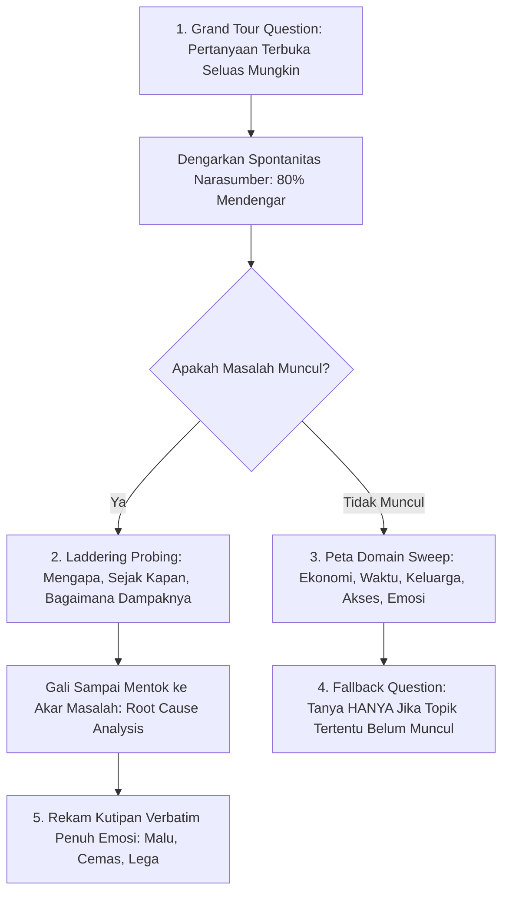

# 🎤 Panduan Wawancara Customer Discovery — Geny StuntCare
*Instrumen Validasi Lapangan, Eksplorasi Masalah Bebas Bias, & Pengujian Solusi 3 Pilar*  
*Program Inkubasi Startup Batch 24 Bandung Techno Park (BTP) : Telkom University*

---

> ### ⚠️ ATURAN EMAS PEWAWANCARA (*GOLDEN RULES*)
> 1. **DILARANG KERAS menyebut kata "stunting" di 10–15 menit pertama wawancara!**  
>    Gunakan istilah netral dan empatik: **"pertumbuhan anak"**, **"panjang/tinggi badan"**, atau **"tumbuh kembang"**. Berdasarkan sintesis literatur nasional dan temuan Consensus AI (2026), label "stunting" memicu resistensi emosional, stigma sosial, rasa malu, serta jawaban defensif/manipulatif dari keluarga balita.
> 2. **DILARANG KERAS mempromosikan aplikasi, pitching ide, atau mendominasi percakapan!**  
>    Terapkan **Prinsip 80/20**: Biarkan narasumber berbicara 80% waktu, pewawancara hanya memfasilitasi dan mengarahkan 20% waktu. Dengarkan cerita masa lalu riil (*past behavior*), bukan sekadar opini atau pengandaian masa depan (*hypothetical promises*).
> 3. **Dua Tahap Riset yang Terpisah Secara Ketat (JANGAN DICAMPUR!):**
>    * **TAHAP 1 (Prioritas Utama — Problem Discovery)**: Pemetaan Customer Journey + Eksplorasi Masalah Terbuka (*Grand Tour Question* & *Laddering Probing*). Tujuannya membongkar akar masalah riil di lapangan tanpa menggiring ke domain tertentu (gizi, ekonomi, waktu, keluarga, akses faskes).
>    * **TAHAP 2 (Sekunder / Opsional — Solution Validation & WTP)**: Reaksi & Perbandingan 3 Pilar Fitur Geny StuntCare + Kesediaan Membayar (*Willingness to Pay* / WTP). Hanya dilakukan setelah masalah utama narasumber teridentifikasi secara jelas. Jika waktu terbatas, **fokus penuh pada Tahap 1**.
> 4. **Durasi Wawancara:** 35 – 45 menit per responden. Wajib merekam audio dengan izin eksplisit (*informed consent*) dan mencatat kutipan langsung (*verbatim*) untuk pernyataan dengan muatan emosional tinggi (malu, marah, cemas, pasrah, atau lega).

---

## 📋 0. Screening Cepat Calon Narasumber (Pra-Wawancara)

Sebelum menjadwalkan wawancara tatap muka atau daring, pastikan calon informan memenuhi salah satu dari 4 kategori persona utama dan catat profil demografisnya:

| Kategori Persona | Kriteria Inklusi Utama | Prioritas Khusus Sampling |
| :--- | :--- | :--- |
| **1. Ibu Hamil** | Sedang mengandung (trimester I, II, atau III); baik kehamilan pertama (primigravida) maupun kehamilan berikutnya (multigravida). | Prioritaskan ibu dengan risiko KEK (LILA < 23,5 cm), riwayat anemia, atau akses faskes terbatas. |
| **2. Ibu Balita** | Memiliki anak usia 0 – 59 bulan yang tinggal serumah. | **Prioritas tertinggi:** Ibu dengan anak usia **6 – 23 bulan** (fase transisi MPASI, titik kritis *growth faltering* stunting nasional). |
| **3. Catin (Calon Pengantin)** | Telah mendaftar nikah di KUA/Gereja/Lembaga Agama atau merencanakan pernikahan dalam rentang 1 – 6 bulan ke depan. | Campur antara yang sudah mengikuti bimbingan/pemeriksaan pranikah (Elsimil/Puskesmas) dan yang belum. |
| **4. Nakes / Kader / TPK** | Bidan desa, kader posyandu aktif (minimal 1 tahun), atau anggota Tim Pendamping Keluarga (TPK) BKKBN. | Prioritaskan kader di posyandu dengan cakupan ILP (Integrasi Layanan Primer) dan area *blank spot* internet. |

> 💡 **Variasi Sampling Antar-Kelompok:** Campurkan responden dari strata ekonomi kurang mampu (desil 1–3 penerima bansos/PKH) dan ekonomi menengah-keatas, domisili perkotaan vs pinggiran/desa, serta variasi usia ibu muda (<20 tahun / remaja) vs usia matang (20–35 tahun).

---

## 🌐 1. Pembuka Universal (5 Menit — Wajib untuk Semua Persona)

*Tujuan: Membangun kenyamanan (*rapport*), memahami struktur pengambil keputusan di rumah tangga, dan memetakan tingkat kesiapan digital narasumber.*

* **Q1 [U1]**: "Boleh ceritakan sedikit tentang keluarga Ibu/Bapak saat ini — tinggal bersama siapa saja di rumah? Apakah ada orang tua, mertua, atau kerabat lain yang ikut tinggal serumah?"  
  *(Catat: Siapa figur dominan dalam rumah tangga yang mempengaruhi keputusan pengasuhan/makanan).*
* **Q2 [U2]**: "Kalau boleh tahu, rutinitas atau kesibukan sehari-hari Ibu/Bapak seperti apa dari pagi sampai malam?"  
  *(Catat: Beban waktu harian, apakah bekerja formal/informal, beban ganda urusan domestik rumah tangga).*
* **Q3 [U3]**: "Sehari-hari Ibu/Bapak menggunakan HP tipe apa (Android/iPhone)? Biasanya HP tersebut paling sering dipakai untuk apa saja selain teleponan dan WhatsApp?"  
  *(Catat: Kapasitas memori, kebiasaan mengunduh aplikasi baru, ketergantungan media sosial TikTok/IG, atau preferensi WA saja).*

---

## 🤰 2. PANDUAN KHUSUS: PERSONA IBU HAMIL

### A. Journey Kehamilan (Kronologis & Fakta Objektif)
* **Q4 [H1]**: "Coba ceritakan dari awal mula Ibu tahu sedang hamil — apa hal pertama yang Ibu lakukan atau siapa orang pertama yang Ibu ajak bicara?"
* **Q5 [H2]**: "Sejak awal kehamilan sampai bulan ini, ke mana saja Ibu biasanya memeriksakan kandungan (ANC)? Kira-kira sudah berapa kali periksa?"
* **Q6 [H3]**: "Saat periksa ke bidan/dokter/puskesmas, pemeriksaan apa saja yang biasanya dilakukan? Apakah Ibu diberi penjelasan mengenai hasil ukuran tensi, lingkar lengan (LILA), atau hasil USG/lab? Ibu paham tidak dengan arti angka-angka itu?"
* **Q7 [H2-lanjutan]**: "Pernah tidak ada jadwal kontrol kehamilan yang terlewat atau tidak sempat Ibu datangi? Kalau pernah, biasanya kendalanya karena apa?"

### B. Eksplorasi Masalah Terbuka (*Grand Tour + Laddering* — Bebas Bias)
* **Q8 [H4 - Grand Tour]**: *"Kalau boleh bercerita bebas dari hati ke hati, apa hal yang paling berat, paling melelahkan, atau paling menyita pikiran Ibu selama menjalani kehamilan ini?"*  
  *(Hening sejenak. Biarkan narasumber menjawab secara spontan tanpa disela atau diarahkan ke topik gizi/stunting).*
* **Q9 [H5 - Laddering Probing]**: *"Kenapa hal itu yang dirasa paling berat menurut Ibu? Sudah mulai terasa sejak usia kehamilan berapa bulan? Waktu beban itu muncul, apa yang biasanya Ibu lakukan? Apakah ada orang sekitar yang membantu?"*  
  *(Terus gali alur cerita konkret narasumber dengan 'mengapa', 'sejak kapan', dan 'bagaimana dampaknya').*
* **Q10 [H6 - Domain: Finansial / Ekonomi]**: "Mengenai kondisi pengeluaran keluarga saat ini, ada tidak kekhawatiran tertentu terkait biaya periksa rutin, suplemen tambahan, atau persiapan persalinan nanti?"
* **Q11 [H6 - Domain: Waktu & Beban Ganda]**: "Pernahkah Ibu merasa kesulitan membagi waktu antara kewajiban istirahat/periksa hamil dengan pekerjaan rumah tangga, merawat anak lain, atau pekerjaan kantor?"
* **Q12 [H6 - Domain: Hubungan Keluarga & Pengaruh Sosial]**: "Bagaimana dengan dukungan suami, orang tua, atau mertua selama masa kehamilan ini? Apakah ada saran, pantangan makanan tradisional, atau komentar orang sekitar yang justru membuat Ibu bingung atau tertekan?"
* **Q13 [H6 - Domain: Kualitas Layanan Faskes]**: "Apakah ada pengalaman tertentu saat datang ke fasilitas kesehatan (Puskesmas/Posyandu/Klinik) yang membuat Ibu merasa sangat terbantu, atau sebaliknya membuat Ibu kecewa/kapok?"
* **Q14 [H7 - Root Cause Identification]**: *"Dari semua cerita yang sudah Ibu sampaikan tadi, jika ditarik ke satu akar penyebab utama, menurut Ibu masalah terbesarnya lebih karena faktor biaya/uang, keterbatasan waktu, minimnya informasi yang jelas, kurangnya dukungan keluarga, atau hal lain?"*
* **Q15 [Fallback Nutrisi — Tanyakan HANYA jika topik makanan belum muncul spontan]**: "Bagaimana dengan pola makan sehari-hari selama hamil ini? Apakah ada kendala seperti mual muntah berlebih (morning sickness), nafsu makan turun, atau kesulitan menyediakan lauk bergizi (protein hewani telur/ikan/daging)?"
* **Q16 [H10 - Persepsi Stunting]**: "Pernahkah Ibu mendengar istilah 'stunting' atau 'anak gagal tumbuh'? Menurut pemahaman Ibu sendiri, apa sih stunting itu dan apa penyebabnya?"  
  *(Cek model mental narasumber: apakah dianggap faktor keturunan/takdir, atau faktor nutrisi dan infeksi).*

### C. Evaluasi Solusi & Alternatif yang Pernah Dicoba
* **Q17 [H8]**: "Selama hamil ini, aplikasi HP atau grup media sosial apa saja yang pernah Ibu unduh atau ikuti untuk memantau perkembangan janin? Apakah sampai sekarang masih aktif dibuka, atau sudah dihapus/ditinggalkan? Mengapa?"
* **Q18 [H9]**: "Pernahkah Ibu mencoba layanan konsultasi dokter berbayar (misal Halodoc, Alodokter, atau konsultasi privat via WA ke bidan)? Berapa biaya yang pernah Ibu keluarkan, dan menurut Ibu sepadan tidak dengan manfaatnya?"

### D. [TAHAP 2 — VALIDASI SOLUSI & WTP] Reaksi Terhadap 3 Pilar Fitur
> ⚠️ *Bagian ini hanya ditanyakan jika sesi Problem Discovery pada Bagian B sudah tuntas dan narasumber masih memiliki waktu luang.*

*Pewawancara menjelaskan secara ringkas:*  
*"Tim kami sedang mengembangkan platform digital pendamping ibu bernama **Geny StuntCare**. Platform ini dirancang dengan 3 pilar layanan utama:*  
1. *Pilar 1 (Skrining Mandiri Cepat)*: Ibu cukup memasukkan data kenaikan berat badan dan ukuran lingkar lengan (LILA), aplikasi langsung menganalisis status risiko kehamilan tanpa harus menunggu jadwal antre di faskes.  
2. *Pilar 2 (Asisten AI 24/7)*: Layanan tanya-jawab interaktif ramah yang siap menjawab kekhawatiran seputar keluhan kehamilan, pantangan mitos, dan tanda bahaya kapan saja.  
3. *Pilar 3 (Rencana Nutrisi Personal Hemat)*: Rekomendasi menu harian kaya protein hewani yang disesuaikan persis dengan batas uang belanja harian keluarga di pasar lokal.*"

* **Q19 [T1 - Fitur Paling Bernilai]**: "Dari ketiga pilar layanan tadi, mana yang menurut Ibu **paling mendesak dan paling Ibu butuhkan** saat ini? Kenapa Ibu memilih pilar tersebut dibandingkan dua pilar lainnya?"
* **Q20 [T2 - Kepercayaan pada Sistem AI]**: "Jika pada Pilar 1 tadi hasil skrining mandiri menunjukkan status 'Berisiko / Kurang Energi Kronis (KEK)', bagaimana reaksi Ibu? Apakah Ibu percaya dengan hasil aplikasi tersebut, atau tetap merasa wajib konfirmasi langsung ke bidan/dokter?"
* **Q21 [T3 - Willingness to Pay (WTP)]**: "Menurut pandangan Ibu, apakah wajar jika layanan yang Ibu pilih di Q19 tadi berbayar? Jika berbayar, berapa biaya langganan per bulan yang menurut Ibu masih terjangkau dan rela dikeluarkan?"
* **Q22 [T3 - Trade-off Prioritas Pengeluaran]**: "Jika harus memilih antara membayar aplikasi pendamping tersebut sebesar Rp15.000–Rp20.000 per bulan ATAU menggunakan uang tersebut untuk membeli setengah kilogram telur ayam tambahan tiap minggu, Ibu akan memilih yang mana? Mengapa?"

### E. Penutup & Aspirasi Utama
* **Q23 [Closing]**: "Jika ada satu hal yang bisa diubah atau diperbaiki saat ini agar masa kehamilan Ibu terasa jauh lebih tenang dan sehat, apa hal terpenting tersebut?"

---

## 👶 3. PANDUAN KHUSUS: PERSONA IBU DENGAN BALITA

### A. Journey Pengasuhan Anak (Kronologis 0–59 Bulan)
* **Q24 [B1]**: "Coba ceritakan sejak si kecil lahir sampai usianya sekarang — bagaimana cara Ibu memantau apakah pertumbuhannya sudah sesuai usianya atau belum?"
* **Q25 [B2]**: "Kapan terakhir kali Ibu membawa anak ke Posyandu atau Puskesmas? Apa saja yang diukur oleh kader, dan bagaimana kader menjelaskan hasil timbangan dan pengukuran tinggi badan tersebut kepada Ibu?"
* **Q26 [B3]**: "Di usia berapa anak mulai dikenalkan makanan pendamping ASI (MPASI)? Jika anak sedang mengalami gerakan tutup mulut (GTM), susah makan, atau berat badannya tidak naik, apa tindakan pertama yang biasanya Ibu lakukan?"

### B. Eksplorasi Masalah Terbuka (*Grand Tour + Laddering* — Bebas Bias)
* **Q27 [B4 - Grand Tour]**: *"Kalau boleh cerita terus terang, apa hal yang paling membuat Ibu pusing, stres, atau merasa sangat lelah dalam merawat dan membesarkan si kecil saat ini?"*  
  *(Hening dan dengarkan cerita spontan narasumber tanpa menggiring).*
* **Q28 [B5 - Laddering Probing]**: *"Mengapa hal itu yang paling menguras pikiran Ibu? Sudah terjadi sejak kapan? Cara apa saja yang sudah Ibu coba untuk mengatasinya, dan bagaimana hasilnya?"*
* **Q29 [B6 - Domain: Finansial / Pengeluaran Anak]**: "Terkait pengeluaran rumah tangga, seberapa berat beban untuk membeli kebutuhan pokok anak seperti susu pertumbuhan, popok sekali pakai, vitamin, atau makanan bergizi?"
* **Q30 [B6 - Domain: Waktu & Pengasuhan]**: "Apakah Ibu mengasuh si kecil sendirian penuh waktu, atau dibantu suami/keluarga/pengasuh? Apakah Ibu pernah merasa sangat kewalahan membagi waktu antara memasak menu khusus anak dengan pekerjaan lainnya?"
* **Q31 [B6 - Domain: Dinamika Keluarga & Pola Asuh]**: "Apakah ada perbedaan pandangan antara Ibu dengan suami, orang tua, atau mertua soal cara memberi makan anak (misal: pemberian makanan padat sebelum usia 6 bulan, jajan sembarangan, konsumsi kental manis)?"
* **Q32 [B6 - Domain: Pengalaman Layanan Posyandu]**: "Bagaimana pengalaman Ibu saat datang ke Posyandu di lingkungan rumah? Apakah ada hal yang membuat Ibu merasa senang, atau justru ada hal yang membuat malas/enggan datang lagi?"
* **Q33 [B7 - Domain: Stigma Sosial & Rasa Malu]**: *"Pernahkah Ibu mendengar komentar dari tetangga, keluarga, atau kader posyandu mengenai fisik anak (misalnya dikatakan 'kok kecil ya', 'kok kurus banget', atau 'anaknya pendek')? Bagaimana perasaan Ibu saat mendengar omongan itu, dan apa yang Ibu lakukan setelahnya?"*  
  *(Gali apakah ada kebiasaan menghindari Posyandu akibat rasa malu atau tersinggung).*
* **Q34 [B8 - Root Cause Identification]**: *"Dari semua tantangan pengasuhan tadi, jika ditarik satu akar masalah utamanya, menurut Ibu hal itu bersumber dari mana: uang/daya beli, kurangnya waktu memasak/mengasuh, bingung memilih informasi makanan yang benar, anak yang gampang sakit, atau kurangnya dukungan orang sekitar?"*
* **Q35 [Fallback Menu — Tanyakan HANYA jika topik nutrisi belum muncul]**: "Bagaimana dengan menu makan si kecil sehari-hari? Berapa kali sehari makan sumber hewani seperti telur, ayam, ikan, atau daging?"

### C. Evaluasi Solusi & Alternatif yang Pernah Dicoba
* **Q36 [B9]**: "Apakah Ibu pernah mengunduh aplikasi tumbuh kembang anak (misal Tentang Anak, Primaku, Kemenkes KIA)? Apa fitur yang paling sering Ibu pakai, dan apa yang membuat Ibu akhirnya jarang membuka atau menghapusnya?"
* **Q37 [B10]**: "Pernahkah kader Posyandu menunjukkan atau mencatatkan data anak Ibu ke aplikasi digital (seperti e-PPGBM atau aplikasi pencatatan lain)? Apakah hasil data tersebut dibagikan kepada Ibu, atau pencatatan itu hanya untuk laporan internal kader saja?"

### D. [TAHAP 2 — VALIDASI SOLUSI & WTP] Reaksi Terhadap 3 Pilar Fitur
*Pewawancara menjelaskan ringkas:*  
*"Geny StuntCare dirancang dengan 3 pilar layanan untuk membantu ibu balita:*  
1. *Pilar 1 (Monitoring Pertumbuhan Cerdas)*: Ibu bisa input berat dan tinggi badan sendiri di rumah kapan saja, aplikasi langsung menghitung kurva standar Z-score WHO dan memberikan peringatan dini bila anak mulai mengalami perlambatan pertumbuhan (*growth faltering*).  
2. *Pilar 2 (Konsultasi Asisten Gizi 24/7)*: Chatbot interaktif untuk mengatasi anak GTM, rekomendasi trik tekstur MPASI, serta panduan pertolongan pertama demam/diare.  
3. *Pilar 3 (Meal Planner MPASI Lokal Murah)*: Rekomendasi jadwal dan resep menu padat gizi protein hewani menggunakan bahan pangan lokal murah yang mudah ditemukan di tukang sayur keliling.*"

* **Q38 [T1 - Pilar Paling Dibutuhkan]**: "Dari ketiga fitur tersebut, mana yang paling menolong mengatasi pusingnya Ibu sehari-hari? Mengapa?"
* **Q39 [T2 - Respon Terhadap Peringatan Risiko]**: "Jika fitur kalkulator kurva pertumbuhan di aplikasi memberitahukan bahwa anak Ibu berada pada status 'Risiko Kurang Gizi / Terindikasi Stunting', apa yang akan Ibu lakukan pertama kali? Apakah Ibu percaya pada aplikasi tersebut, atau merasa panik dan marah?"
* **Q40 [T3 - Willingness to Pay (WTP)]**: "Jika fitur yang paling Ibu butuhkan di Q38 tadi berbayar, fitur mana yang menurut Ibu paling layak untuk dibayar? Berapa biaya langganan bulanan yang menurut Ibu wajar?"
* **Q41 [T3 - Skema Berlangganan]**: "Apakah biaya berlangganan sebesar Rp15.000 hingga Rp25.000 per bulan masuk akal untuk keluarga Ibu? Jika dirasa berat, berapa batas nominal yang membuat Ibu tertarik mencoba?"

### E. Penutup
* **Q42 [Closing]**: "Jika Ibu diizinkan meminta satu bantuan nyata kepada pemerintah atau pembuat aplikasi kesehatan terkait pengasuhan si kecil, apa bantuan terpenting yang Ibu harapkan?"

---

## 💍 4. PANDUAN KHUSUS: PERSONA CALON PENGANTIN (CATIN)

### A. Journey Persiapan Pranikah (Kronologis)
* **Q43 [C1]**: "Boleh ceritakan proses persiapan pernikahan Mas/Mbak sejauh ini — hal-hal apa saja yang sudah diurus dan dipersiapkan?"
* **Q44 [C2]**: "Apakah sudah pernah mengikuti bimbingan pranikah atau kursus calon pengantin (di KUA, Puskesmas, atau Badan Keagamaan)? Materi apa saja yang dibahas dalam bimbingan tersebut, dan seberapa banyak yang masih diingat?"
* **Q45 [C3]**: "Apakah sudah melakukan pemeriksaan kesehatan pranikah (seperti cek kadar Hb darah, ukuran LILA, atau imunisasi TT)? Bagaimana petugas kesehatan menyampaikan dan menjelaskan hasil pemeriksaan tersebut kepada Mas/Mbak?"

### B. Eksplorasi Masalah Terbuka (*Grand Tour + Laddering*)
* **Q46 [C4 - Grand Tour]**: *"Menjelang hari pernikahan dan kehidupan berumah tangga nanti, hal apa yang saat ini paling menyita pikiran, membingungkan, atau membuat cemas Mas/Mbak?"*
* **Q47 [C5 - Laddering Probing]**: *"Mengapa hal tersebut yang dirasa paling membebani? Sejak kapan mulai mengkhawatirkan hal itu? Sudah sempat dibicarakan berdua dengan pasangan belum?"*
* **Q48 [C6 - Domain: Finansial & Biaya Hidup]**: "Terkait alokasi dana, apakah biaya resepsi/acara pernikahan saat ini menekan rencana anggaran tabungan rumah tangga dan persiapan kehamilan kelak?"
* **Q49 [C6 - Domain: Waktu & Stres Persiapan]**: "Apakah ada kesibukan kerja yang terganggu akibat harus bolak-balik mengurus berkas administrasi dan persiapan nikah?"
* **Q50 [C6 - Domain: Tekanan Keluarga & Tradisi]**: "Apakah ada tuntutan atau ekspektasi tertentu dari pihak orang tua/calon mertua (seperti harus langsung punya momongan segera, adat istiadat, atau pantangan) yang menimbulkan beban pikiran?"
* **Q51 [C6 - Domain: Akses Informasi Kesehatan Reproduksi]**: "Seberapa mudah Mas/Mbak mendapatkan panduan kesehatan pranikah yang jelas dan tidak membosankan? Apakah materi resmi yang ada saat ini terasa kaku atau kurang relevan?"
* **Q52 [C7 - Root Cause Identification]**: *"Jika ditarik satu benang merah, kecemasan terbesar menjelang nikah ini lebih disebabkan oleh masalah kesiapan finansial, minimnya edukasi pengasuhan, restu/tekanan keluarga, atau rasa belum siap mental menjadi orang tua?"*
* **Q53 [Fallback Calon Ayah / Kemitraan]**: "Menurut pandangan Mas/Mbak, urusan pemeriksaan kesehatan pranikah dan pencegahan anak lahir stunting itu tanggung jawab pihak calon ibu saja, atau tanggung jawab bersama berdua?"

### C. Evaluasi Solusi & Alternatif yang Pernah Dicoba
* **Q54 [C9]**: "Apakah Mas/Mbak pernah diminta mengunduh atau mengisi aplikasi pranikah dari instansi pemerintah (seperti Elsimil dari BKKBN atau SIMKAH Kemenag)? Bagaimana kesan penggunaannya, apakah mudah dipahami atau terasa sekadar formalitas syarat nikah?"
* **Q55 [C9]**: "Jika ingin mencari informasi seputar kesehatan reproduksi dan kesiapan hamil, kanal apa yang paling Mas/Mbak percaya (media sosial dokter/influencer, artikel Google, saran orang tua, atau bidan)?"

### D. [TAHAP 2 — VALIDASI SOLUSI & WTP] Reaksi Terhadap 3 Pilar Fitur
*Pewawancara menjelaskan ringkas:*  
*"Geny StuntCare merancang modul khusus Calon Pengantin yang menyediakan:*  
1. *Pilar 1 (Skor Kesiapan Pranikah Holistik)*: Cukup input data lingkar lengan, indeks massa tubuh, dan pola makan dasar, aplikasi menampilkan skor kesiapan fisik & edukasi risiko kehamilan dini.  
2. *Pilar 2 (Konsultasi Pranikah Interaktif)*: Tanya jawab anonim dan nyaman seputar kesehatan reproduksi, nutrisi pencegah anemia/BBLR, dan persiapan 1000 Hari Pertama Kehidupan.  
3. *Pilar 3 (Edukasi Nutrisi & Pola Hidup Pasangan Muda)*: Modul praktis harian untuk mempersiapkan sel telur dan sperma yang sehat sebelum konsepsi.*"

* **Q56 [T1 - Pilar Paling Menarik]**: "Dari ketiga fitur pranikah tersebut, mana yang paling menarik dan relevan bagi pasangan muda seusia Mas/Mbak?"
* **Q57 [T2 - Kepercayaan pada Skor Kesiapan]**: "Jika skor kesiapan pranikah menunjukkan hasil 'Perlu Perbaikan Nutrisi / Anemia', apakah Mas/Mbak akan langsung menindaklanjutinya dengan periksa lab ke puskesmas, atau menganggapnya angin lalu?"
* **Q58 [T3 - Model Pembayaran Bundling]**: "Apakah wajar jika fitur kesiapan pranikah ini dijadikan satu paket kecil (*bundling*) dengan biaya administrasi pendaftaran pranikah (misal Rp20.000–Rp30.000 sekali bayar untuk akses 6 bulan)? Atau lebih baik gratis didanai instansi pemerintah?"

### E. Penutup
* **Q59 [Closing]**: "Kelak ketika sudah resmi menjadi orang tua dan memiliki momongan, apa kekhawatiran terbesar Mas/Mbak mengenai tumbuh kembang anak di era sekarang?"

---

## 🩺 5. PANDUAN KHUSUS: PERSONA NAKES / KADER POSYANDU / TPK

### A. Journey Kerja Harian & Beban Operasional Posyandu
* **Q60 [N1]**: "Bisa ceritakan alur kerja Ibu/Bapak dari H-1 sebelum pelaksanaan Posyandu, saat hari H pelaksanaan, sampai H+2 setelah Posyandu selesai? Apa saja tahapannya?"
* **Q61 [N3]**: "Bagaimana kondisi alat ukur antropometri kit (timbangan digital balita, infantometer panjang badan, stadiometer tinggi badan, pita LILA) yang dipakai saat ini? Apakah semua alat sudah standar Kemenkes, atau masih memakai dacin gantung dan alat manual?"
* **Q62 [N2]**: "Setelah pengukuran balita selesai, bagaimana proses pencatatan dan pelaporan datanya? Apakah dicatat di buku register manual dulu baru diketik ulang ke laptop/HP, atau langsung masuk ke sistem online (e-PPGBM / SIGIZI Terpadu / ASIK)?"

### B. Eksplorasi Masalah Terbuka (*Grand Tour + Laddering*)
* **Q63 [N4 - Grand Tour]**: *"Kalau boleh berbicara jujur tanpa beban, apa kendala paling berat, paling menyita waktu, atau paling membuat lelah dalam menjalankan tugas sebagai kader posyandu / tenaga kesehatan saat ini?"*
* **Q64 [N5 - Laddering Probing]**: *"Mengapa proses tersebut yang dirasa paling melelahkan? Sudah berlangsung berapa lama? Bagaimana cara Ibu/Bapak dan rekan-rekan kader mengatasinya selama ini?"*
* **Q65 [N6 - Domain: Beban Kerja & 25 Kompetensi ILP]**: "Dengan adanya kebijakan Integrasi Layanan Primer (ILP) di mana posyandu melayani seluruh siklus hidup (balita, remaja, dewasa, lansia), seberapa besar peningkatan beban administrasi yang dirasakan kader?"
* **Q66 [N6 - Domain: Insentif & Jumlah Personel]**: "Bagaimana dengan ketersediaan jumlah kader aktif di wilayah Ibu/Bapak? Apakah insentif operasional bulanan yang diterima sebanding dengan beban survei lapangan dan pelaporan data yang harus dikerjakan?"
* **Q67 [N7 - Domain: Tantangan Komunikasi & Penolakan Warga]**: *"Pernahkah Ibu/Bapak mengalami situasi di mana orang tua balita menolak, marah, atau tersinggung saat diberitahu bahwa anaknya memiliki status gizi kurang atau terindikasi stunting? Bagaimana cara Ibu/Bapak menyampaikan kabar tersebut, dan bagaimana reaksi warga?"*
* **Q68 [N8 - Domain: Infrastruktur & Blank Spot Internet]**: "Bagaimana kondisi jaringan internet di lokasi posyandu atau saat kunjungan rumah ke pelosok desa? Apa yang terjadi pada proses pencatatan digital jika sinyal tiba-tiba hilang total (*blank spot*)?"
* **Q69 [N9 - Root Cause Identification]**: *"Jika ditarik satu akar masalah paling mendasar, hambatan utama pencegahan stunting di tingkat posyandu ini lebih karena alat ukur yang kurang presisi, sistem aplikasi pelaporan pemerintah yang lambat/rumit, minimnya insentif kader, atau resistensi/kurangnya kesadaran masyarakat?"*

### C. Evaluasi Solusi & Sistem Digital Eksisting
* **Q70 [N10]**: "Apa keluhan utama Ibu/Bapak saat menginput data balita ke sistem pencatatan resmi pemerintah saat ini (e-PPGBM / SIGIZI / ASIK)? Mengapa sering terjadi keluhan server down atau data lambat masuk?"
* **Q71 [N10]**: "Apakah data yang sudah diinput ke sistem tersebut pernah diolah kembali menjadi informasi bermanfaat yang langsung bisa dipakai kader untuk mendampingi ibu balita, atau hanya berhenti sebagai laporan statistik ke dinas kesehatan?"

### D. [TAHAP 2 — VALIDASI SOLUSI & WTP B2B/B2G] Reaksi Terhadap 3 Pilar Fitur
*Pewawancara menjelaskan ringkas:*  
*"Geny StuntCare merancang solusi asisten posyandu cerdas yang memiliki 3 kapabilitas utama:*  
1. *Pilar 1 (Kalkulator Triase Antropometri Offline-First)*: Kader cukup memasukkan angka BB dan TB balita, aplikasi langsung menghitung kurva standar Z-score WHO secara instan TANPA INTERNET (otomatis tersinkronisasi saat sinyal aktif). Dilengkapi pendeteksi anomali data (mencegah salah ketik data ekstrim).  
2. *Pilar 2 (Sistem Edukasi Interaktif Warga Mandiri)*: Ibu balita dapat mengakses informasi gizi dan jadwal posyandu secara mandiri lewat HP masing-masing, mengurangi beban kader bolak-balik menjelaskan hal yang sama.  
3. *Pilar 3 (Generator Menu PMT Berbahan Pangan Lokal Cepat)*: Rekomendasi komposisi menu PMT (Pemberian Makanan Tambahan) Posyandu berbasis bahan pangan lokal yang memenuhi standar protein hewani Kemenkes.*"

* **Q72 [T1 - Fitur Paling Menolong Tugas Kader]**: "Dari ketiga fitur pendukung posyandu tersebut, mana yang paling meringankan beban kerja harian Ibu/Bapak di lapangan? Mengapa?"
* **Q73 [T2 - Dampak Beban Kerja]**: "Jika aplikasi pencatatan otomatis offline tersebut diterapkan, apakah menurut Ibu/Bapak akan benar-benar menghemat waktu Posyandu, atau justru dikhawatirkan menambah kerumitan baru bagi kader senior?"
* **Q74 [T3 - Skema Pembiayaan B2G / Kelembagaan]**: "Jika alat atau sistem penunjang posyandu ini membutuhkan biaya implementasi/lisensi perangkat lunak, sumber pendanaan mana di tingkat desa/daerah yang paling realistis untuk membiayainya (Dana Desa, Alokasi APBD Puskesmas, CSR Perusahaan, atau Program Makan Bergizi Gratis SPPG MBG)?"
* **Q75 [T3 - Ambang Batas Adopsi]**: "Seberapa jauh sistem baru ini harus lebih cepat atau lebih mudah dibandingkan e-PPGBM agar kader posyandu rela beralih kebiasaan menggunakannya?"

### E. Penutup
* **Q76 [Closing]**: "Jika Ibu/Bapak diberikan wewenang penuh untuk merombak sistem operasional Posyandu dari nol, satu perubahan paling mendasar apa yang ingin Ibu/Bapak wujudkan demi masa depan anak-anak di desa ini?"

---

## 🧠 6. Panduan Eksekusi Pewawancara (Teknik Laddering & Bebas Bias)

Untuk menjamin kemurnian data lapangan dan memenuhi standar saintifik BTP Batch 24, setiap pewawancara wajib mempedomani kaidah berikut:

1. **Grand Tour Question Dulu, Baru Menyempit**: Jangan pernah mengarahkan subjek pada jawaban tertentu. Buka dengan pertanyaan seluas mungkin ("Apa hal yang paling berat...").
2. **Laddering (Teknik 5-Whys)**: Setiap kali narasumber menyebutkan suatu rintangan, tanyakan "Kenapa hal itu bisa terjadi?", "Sejak kapan mulai dirasakan?", dan "Bagaimana dampaknya ke pengasuhan si kecil?". Jangan puas dengan jawaban normatif satu kalimat.
3. **Peta Domain adalah Alat Dengar, Bukan Checklist Kaku**: Domain Ekonomi, Beban Waktu, Dinamika Keluarga, Akses Layanan, dan Emosi dirancang sebagai kerangka pemetaan di lembar catatan. Jika narasumber sudah menceritakan kendala biaya secara alami, jangan tanyakan lagi pertanyaan domain biaya secara kaku.
4. **Catat Verbatim Beremosi Kuat**: Tulislah kalimat persis apa adanya yang diucapkan narasumber saat menunjukkan ekspresi malu, takut, marah, pasrah, atau lega. Kutipan ini adalah bukti empiris tak ternilai (*pain evidence*) untuk pitch deck investor dan validasi persona BTP.
5. **Positive Deviance (Kasus Negatif itu Emas)**: Jika menemukan keluarga dengan tingkat ekonomi sangat rendah namun balitanya tumbuh optimal dan bebas stunting, gali lebih dalam strategi pengasuhan mereka. Sebaliknya, jika menemukan keluarga mampu dengan balita stunting, identifikasi kontradiksi pengasuhan di rumah tangga tersebut.

---

## 🔬 7. Referensi Hipotesis Literatur Pembanding (Pasca-Wawancara)

> ⚠️ **PERINGATAN KERAS:** Tabel hipotesis ini **BUKAN** naskah pertanyaan wawancara! Tabel ini digunakan secara ketat **SETELAH** transkrip wawancara selesai direkap, untuk menguji apakah temuan empiris di lapangan **mengonfirmasi (*confirm*)**, **membantah (*refute*)**, atau **menemukan anomali baru (*novel insight*)** terhadap literatur riset stunting nasional.

| Hipotesis Riset & Literatur (Data Crawling 2026) | Titik Verifikasi di Transkrip Lapangan (Cek Kemunculan Spontan) |
| :--- | :--- |
| **Stigma Sosial Posyandu**: Ibu balita berhenti datang ke Posyandu bukan karena malas, melainkan karena malu/takut dikomentari anaknya pendek/kurus. | Cek kemunculan di Q28 [B5], Q32 [B6], Q33 [B7], dan Q67 [N7]. |
| **Beban Kognitif & Administrasi Kader**: Kader Posyandu kelelahan karena beban pelaporan ganda (manual + sistem digital yang sering error). | Cek kemunculan di Q60 [N1], Q62 [N2], Q63 [N4], Q65 [N6], dan Q70 [N10]. |
| **Keterbatasan Infrastruktur Blank Spot**: Area dengan beban stunting tinggi kerap mengalami ketiadaan sinyal internet, mewajibkan arsitektur offline-first. | Cek kemunculan di Q3 [U3], Q68 [N8], dan Q73 [T2]. |
| **Otonomi Ibu Terbatas**: Pengambilan keputusan menu makan balita dan jadwal ANC didominasi oleh mertua, nenek, atau suami. | Cek kemunculan di Q1 [U1], Q12 [H6], Q26 [B3], Q31 [B6], dan Q50 [C6]. |
| **"Tahu Tapi Tidak Mampu" (Finansial vs Literasi)**: Ibu paham pentingnya protein hewani (telur/ikan), tetapi daya beli harian tidak mencukupi. | Cek kemunculan di Q10 [H6], Q14 [H7], Q29 [B6], Q34 [B8], dan Q35 [Fallback]. |
| **Diskontinuitas Layanan 1000 HPK**: Rantai pemantauan terputus antara masa hamil (ANC), pasca-persalinan, imunisasi, dan pemantauan balita di posyandu. | Cek kemunculan di Q5 [H2], Q25 [B2], dan Q60 [N1]. |
| **Prioritas Solusi Riil Lapangan**: Pasar lebih membutuhkan alat deteksi dini cepat dan menu lokal murah daripada chatbot percakapan umum. | Cek distribusi pilihan fitur di Tahap 2: Q19 [H-T1], Q38 [B-T1], Q56 [C-T1], dan Q72 [N-T1]. |

---

*Disusun secara komprehensif untuk Tim Riset Lapangan Geny StuntCare — Inkubasi Startup BTP Batch 24 Telkom University.*
